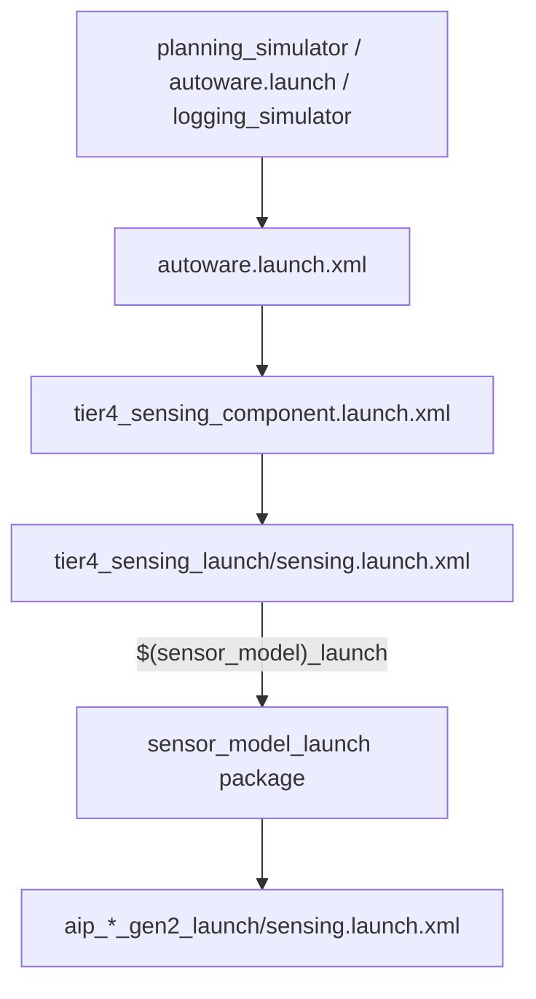
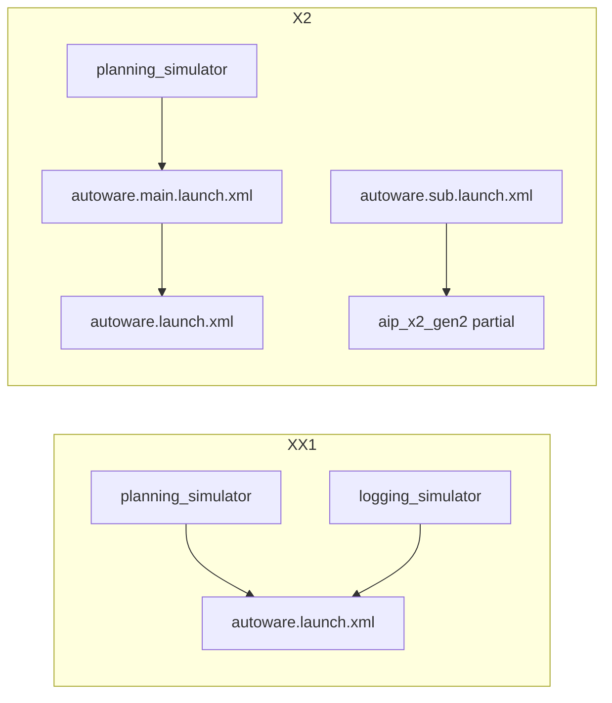
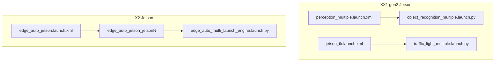
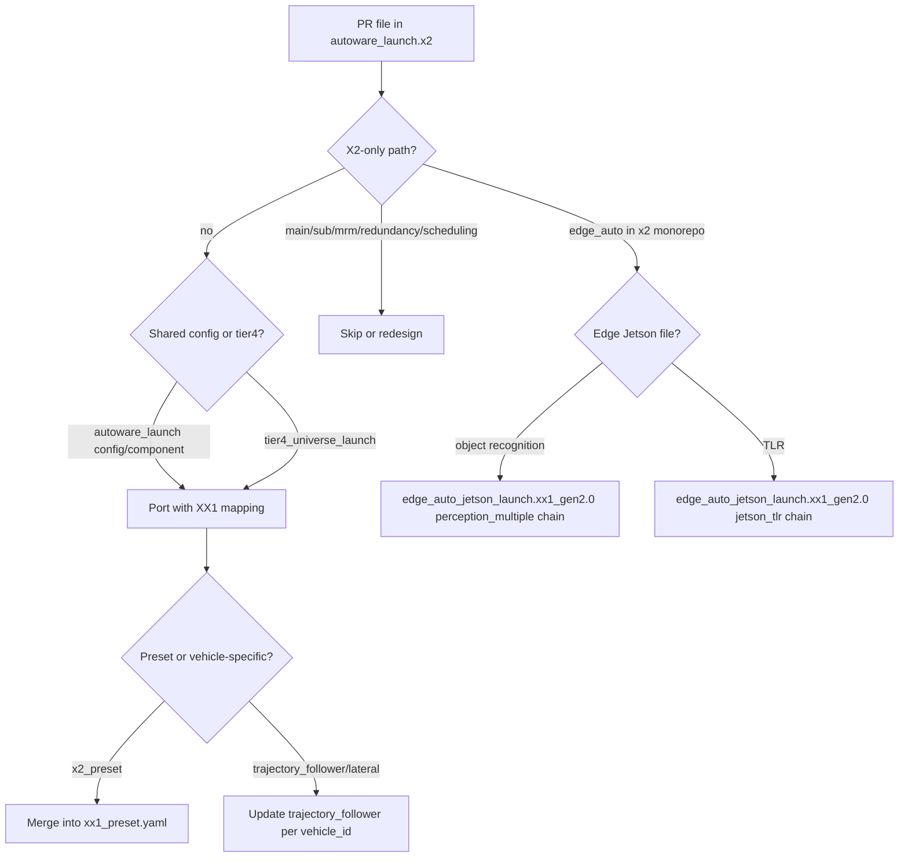

# XX1 vs X2 Launch — Agent Knowledge Reference

Concise, indexable guide for AI agents working across `autoware_launch.xx1`, `autoware_launch.x2`, and `edge_auto_jetson_launch.xx1_gen2.0`.

---

## Document index

| §                                                   | Topic                                        |
| --------------------------------------------------- | -------------------------------------------- |
| [§1](#1-quick-reference)                            | Quick reference                              |
| [§2](#2-repository-topology)                        | Repository topology                          |
| [§3](#3-launch-workflows-and-entry-points)          | Launch workflows and entry points            |
| [§4](#4-sensing-aip_xx1_gen2-vs-aip_x2_gen2)        | Sensing: `aip_xx1_gen2` vs `aip_x2_gen2`     |
| [§5](#5-presets-and-trajectory_follower)            | Presets and `trajectory_follower`            |
| [§6](#6-perception-individual_params-and-data_path) | Perception, `individual_params`, `data_path` |
| [§7](#7-edge_auto_jetson-three-repo-model)          | Edge auto Jetson (three-repo model)          |
| [§8](#8-cherry-pick-playbook-x2--xx1)               | Cherry-pick playbook (X2 → XX1)              |
| [§9](#9-file-path-index-hotspots)                   | File path index (hotspots)                   |

---

## 1. Quick reference

| Item                           | XX1                                                           | X2                                                                   |
| ------------------------------ | ------------------------------------------------------------- | -------------------------------------------------------------------- |
| Core sensor package            | `aip_xx1_gen2_launch` + `aip_xx1_gen2_description`            | `aip_x2_gen2_launch` + `aip_x2_gen2_description`                     |
| `sensor_model` on vehicle      | `aip_xx1_gen2`                                                | `aip_x2_gen2`                                                        |
| Planning preset                | `xx1` → `config/planning/preset/xx1_preset.yaml`              | `x2` → `config/planning/preset/x2_preset.yaml`                       |
| Control preset                 | `xx1` → `config/control/preset/xx1_preset.yaml`               | `x2` → `config/control/preset/x2_preset.yaml`                        |
| `data_path` default            | `$(env HOME)/autoware_data`                                   | `/opt/autoware/mlmodels`                                             |
| `use_individual_control_param` | `true` (per-`vehicle_id` MPC/PID dirs)                        | `false` (shared `lateral/` / `longitudinal/`)                        |
| Main on-vehicle launch         | `autoware.launch.xml`                                         | `autoware.main.launch.xml` → `autoware.launch.xml`                   |
| Planning sim wraps             | `autoware.launch.xml`                                         | `autoware.main.launch.xml`                                           |
| Edge Jetson in monorepo        | **No** (external repo)                                        | `edge_auto_jetson_launch/`                                           |
| XX1 edge production entrances  | `perception_multiple.launch.xml`, `tlr/jetson_tlr.launch.xml` | N/A (use X2 router below)                                            |
| X2 edge production entrance    | N/A                                                           | `edge_auto_jetson.launch.xml` → `edge_auto_jetson_jetsonN` / `addon` |

---

## 2. Repository topology

Both monorepos share: `autoware_launch/`, `aip_launcher/`, `tier4_universe_launch/`, `sensor_kit/`, `vehicle/`.

| Area                       | `autoware_launch.xx1`                | `autoware_launch.x2`                |
| -------------------------- | ------------------------------------ | ----------------------------------- |
| `autoware_launch/launch/`  | 5 entry XML (+ `bench_simulator`)    | 10 entry XML (+ main/sub/MRM/rviz)  |
| `aip_launcher/`            | `aip_xx1_gen2_*`, legacy `aip_xx1_*` | `aip_x2_gen2_*`, legacy `aip_xx1_*` |
| `edge_auto_jetson_launch/` | **Absent**                           | In-tree                             |
| Extra top-level            | —                                    | `edge_auto_jetson_launch/`          |

**Third repo (XX1 Jetson cameras):** `edge_auto_jetson_launch.xx1_gen2.0/` — future merge target for `autoware_launch.xx1/edge_auto_jetson_launch/`.



Resolution: `tier4_sensing_launch/launch/sensing.launch.xml` sets `sensor_launch_pkg = $(find-pkg-share $(var sensor_model)_launch)`.

---

## 3. Launch workflows and entry points

### 3.1 XX1 (`autoware_launch.xx1`)

| Use case           | Launch file                            | Wraps                                           |
| ------------------ | -------------------------------------- | ----------------------------------------------- |
| On-vehicle / dev   | `launch/autoware.launch.xml`           | Full stack                                      |
| Planning simulator | `launch/planning_simulator.launch.xml` | `autoware.launch.xml` (`launch_sensing:=false`) |
| Rosbag / logging   | `launch/logging_simulator.launch.xml`  | `autoware.launch.xml`, `use_sim_time:=true`     |
| Bench              | `launch/bench_simulator.launch.xml`    | XX1-only                                        |
| E2E                | `launch/e2e_simulator.launch.xml`      | `autoware.launch.xml`                           |

**Defaults in `autoware.launch.xml`:**

- `planning_module_preset` / `control_module_preset` = `xx1`
- `perception_mode` = `camera_lidar_radar_fusion` when `sensor_model == aip_xx1_gen2` (else `camera_lidar_fusion`)
- `rviz` default `true`, config `autoware.rviz`
- `use_foa`, `scene_module_manager` path variants for scenario sim
- No `launch_v2x`, `launch_l4_toolkit`, `is_redundant`, agnocast, or scheduling by default

**Component wiring:** presets passed as `module_preset` into `tier4_planning_component.launch.xml` and `tier4_control_component.launch.xml`.

### 3.2 X2 (`autoware_launch.x2`)

| Use case               | Launch file                                                    | Notes                                                           |
| ---------------------- | -------------------------------------------------------------- | --------------------------------------------------------------- |
| Full vehicle (typical) | `launch/autoware.main.launch.xml`                              | Wraps `autoware.launch.xml`; redundancy/MRM when `is_redundant` |
| Sub ECU                | `launch/autoware.sub.launch.xml`                               | Partial stack; direct `aip_x2_gen2` IMU; own control container  |
| Sub RViz               | `launch/autoware_sub_rviz.launch.xml`                          | Viz only                                                        |
| MRM test               | `*.main.mrm.launch.xml`, `planning_simulator.*.mrm.launch.xml` | Fail-safe / election                                            |
| Planning simulator     | `launch/planning_simulator.launch.xml`                         | **`autoware.main.launch.xml`**                                  |
| Logging                | `launch/logging_simulator.launch.xml`                          | Direct `autoware.launch.xml`                                    |

**Defaults in `autoware.launch.xml`:**

- Presets = `x2`
- `launch_v2x`, `launch_l4_toolkit`, `launch_perception_filter`
- `is_redundant`, `is_main_ecu`, `/main/...` topic namespaces when redundant
- Agnocast heaphook on pointcloud container + sensing/localization/perception
- `enable_scheduling_settings`, `scheduling_settings.launch.py`
- `rviz` default `false`, config `autoware_x2.rviz`
- Trajectory relay: `/planning/trajectory` → `/planning/scenario_planning/trajectory`



### 3.3 X2-only launch files (never cherry-pick verbatim to XX1)

- `autoware.main.launch.xml`, `autoware.main.mrm.launch.xml`
- `autoware.sub.launch.xml`, `autoware_sub_rviz.launch.xml`
- `planning_simulator.sub.launch.xml`, `planning_simulator.main.mrm.launch.xml`
- `scheduling_settings.launch.py`

### 3.4 XX1-only launch files

- `bench_simulator.launch.xml`
- `launch/components/ecu_monitoring.logging.*` (if present)

---

## 4. Sensing: `aip_xx1_gen2` vs `aip_x2_gen2`

Cameras on XX1 gen2 are **not** in `aip_xx1_gen2_launch/sensing.launch.xml` (camera block commented). Jetson edge repo handles cameras (§7).

| Aspect              | XX1 `aip_xx1_gen2_launch`                                                   | X2 `aip_x2_gen2_launch`                                              |
| ------------------- | --------------------------------------------------------------------------- | -------------------------------------------------------------------- |
| LiDAR               | `lidar.launch.py` + `lidar_gen2.yaml` / `lidar_gen2_1.yaml` by `vehicle_id` | `lidar.launch.xml`, 8× Pandar, Nebula containers                     |
| IMU                 | CAN (`imu_connection:=can`)                                                 | Standard; sub ECU uses `imu_corrector.sub.param.yaml`                |
| Radar               | `ars548` version arg                                                        | Multi ARS548 + mergers                                               |
| `individual_params` | `.../aip_xx1_gen2/`                                                         | `.../aip_x2_gen2/`                                                   |
| Extra               | —                                                                           | Agnocast, topic_state_monitor, point_filters, distortion/dual-return |

**Cherry-pick:** Do not copy X2 `lidar.launch.xml` / Nebula trees into XX1; remap to `lidar.launch.py` + YAML config.

---

## 5. Presets and `trajectory_follower`

### 5.1 Module presets

Loaded via:

```xml
<include file="$(find-pkg-share autoware_launch)/config/{planning|control}/preset/$(var module_preset)_preset.yaml"/>
```

| Vehicle | Planning          | Control           |
| ------- | ----------------- | ----------------- |
| XX1     | `xx1_preset.yaml` | `xx1_preset.yaml` |
| X2      | `x2_preset.yaml`  | `x2_preset.yaml`  |

**Do not overwrite XX1 presets with X2 files.** Notable default diffs:

| Flag                                | XX1 `xx1_preset` | X2 `x2_preset` |
| ----------------------------------- | ---------------- | -------------- |
| `launch_dynamic_obstacle_avoidance` | `true`           | `false`        |
| `launch_side_shift_module`          | `true`           | `false`        |

Merge PR logic into `xx1_preset.yaml`; preserve XX1 vehicle policy.

### 5.2 Trajectory follower layout (critical)

|              | XX1                                                                                     | X2                                                                      |
| ------------ | --------------------------------------------------------------------------------------- | ----------------------------------------------------------------------- |
| Path pattern | `config/control/trajectory_follower/{vehicle_id}/lateral\|longitudinal/*.param.yaml`    | `config/control/trajectory_follower/lateral\|longitudinal/*.param.yaml` |
| Dirs         | `default`, `CS20-001`…`003`, `1`…`10`, `gen2_bench`, `awsim_jpt`, …                     | Shared only (+ `.redundancy.sub.param.yaml` on sub ECU)                 |
| Selection    | `use_individual_control_param:=true` → `latlon_controller_param_path_dir=$(vehicle_id)` | `use_individual_control_param:=false` → empty dir                       |

**Path template (XX1 control component):**

```
config/control/trajectory_follower/$(vehicle_id)/lateral/$(lateral_controller_mode).param.yaml
config/control/trajectory_follower/$(vehicle_id)/longitudinal/$(longitudinal_controller_mode).param.yaml
```

**Cherry-pick control params from X2:**

1. Edit shared X2 `lateral/` / `longitudinal/` only if all X2 vehicles should match.
2. For XX1, replicate into each production `vehicle_id` subtree (or `default/`).
3. Do **not** flatten XX1 per-vehicle dirs to match X2 layout.

---

## 6. Perception, `individual_params`, and `data_path`

### 6.1 Lidar model param files

| X2-only                     | XX1-only                        | Shared name, diff content                                                |
| --------------------------- | ------------------------------- | ------------------------------------------------------------------------ |
| `centerpoint_x2.param.yaml` | `transfusion_xx1.param.yaml`    | `centerpoint*.param.yaml`, `transfusion.param.yaml` vs `transfusion_xx1` |
| —                           | `fusion_common_gen2.param.yaml` | `fusion_common.param.yaml`                                               |

### 6.2 `tier4_perception_component.launch.xml` divergences

- **XX1:** `occupancy_grid_map_method` let for `aip_xx1_gen2`; `traffic_light_recognition/fusion_only`; hardcoded `/opt/autoware/mlmodels/{centerpoint,transfusion,...}` in some paths; `object_recognition_detection_lidar_model_param_path` → `config/.../lidar_model/`
- **X2:** Six+ camera topic remaps; V2X `/v2x/traffic_signals`; `launch_perception_filter` input topic lets; agnocast; `data_path`-relative model paths

### 6.3 `individual_params` (main ECU)

```
individual_params/config/$(vehicle_id)/$(sensor_model)/...
```

Always rename `aip_x2_gen2` → `aip_xx1_gen2` (or `aip_xx1` where edge repo still uses legacy name).

### 6.4 `logging_simulator` differences

- **XX1:** Diagnostic graph branch for `aip_xx1_gen2` (`autoware-main_gen2.yaml` vs `autoware-main.yaml`); `use_external_lane_change`, `scenario_simulation` default `false`
- **X2:** `scenario_simulation` default `true`; scheduling / perception_filter args

---

## 7. Edge auto Jetson (three-repo model)

### 7.1 Three locations

| Location                                      | Role                        | `individual_params`                                               |
| --------------------------------------------- | --------------------------- | ----------------------------------------------------------------- |
| `autoware_launch.x2/edge_auto_jetson_launch/` | In-tree X2 Jetson           | `.../$(vehicle_id)/$(SENSOR_MODEL aip_x2_gen2)/tier4-c2/`         |
| `edge_auto_jetson_launch.xx1_gen2.0/`         | **Current** XX1 gen2 Jetson | Production: `aip_xx1/tier4-c2/`; legacy: `$(vehicle_id)/cameraN/` |
| `autoware_launch.xx1/`                        | Future integration          | Target: `aip_xx1_gen2/tier4-c2/`                                  |

Until merge: **XX1 edge cherry-picks go to `edge_auto_jetson_launch.xx1_gen2.0`**, not `autoware_launch.xx1`.

### 7.2 XX1 gen2 production entrances (primary)

XX1 Jetson uses **two** top-level launches on vehicle (typically separate processes/systemd units):

| Entrance                      | File                                    | Pipeline                        | Downstream                                     |
| ----------------------------- | --------------------------------------- | ------------------------------- | ---------------------------------------------- |
| **Object recognition**        | `launch/perception_multiple.launch.xml` | Multi-camera YOLOX + ByteTrack  | `launch/object_recognition_multiple.launch.py` |
| **Traffic light recognition** | `launch/tlr/jetson_tlr.launch.xml`      | TLR cameras default `[0,2,5,6]` | `launch/tlr/traffic_light_multiple.launch.py`  |

**Shared behavior:**

- Trigger: `individual_params/config/$(VEHICLE_ID)/$(SENSOR_MODEL aip_xx1)/tier4-c2/trigger.param.yaml`
- `sensor_trigger1` (perception_multiple) vs `sensor_trigger2` (jetson_tlr)

**Default camera IDs (perception_multiple):**

- `object_recognition_camera_ids`: `[0, 3, 4, 9, 10]`
- `camera_driver_camera_ids`: `[3, 4, 9, 10]`

### 7.3 XX1 legacy entrances (do not use as primary)

| File                                   | Role                                                                         |
| -------------------------------------- | ---------------------------------------------------------------------------- |
| `launch/edge_auto_jetson.launch.xml`   | Dispatches `perception_jetson$(jetson_id).launch.xml` via `JETSON_ID`        |
| `launch/perception_jetson0.launch.xml` | Monolithic camera0/1 inline pipelines; params under `$(vehicle_id)/cameraN/` |

### 7.4 X2 edge entrance (comparison)

Single router:

```
edge_auto_jetson.launch.xml
  → edge_auto_jetson_{jetson0|jetson1|jetson2|addon}.launch.xml
  → edge_auto_multi_launch_engine.launch.py
```

Unifies object recognition, TLR, camera drivers, diagnostics per ECU.

### 7.5 Cherry-pick mapping: X2 edge → XX1 gen2 repo

| X2 change location                                             | Port to XX1                                                                |
| -------------------------------------------------------------- | -------------------------------------------------------------------------- |
| `edge_auto_jetson_jetsonN.launch.xml` object_recognition block | `perception_multiple.launch.xml` + `object_recognition_multiple.launch.py` |
| `traffic_light_camera_ids` / TLR in multi engine               | `tlr/jetson_tlr.launch.xml` + `tlr/traffic_light_multiple.launch.py`       |
| `camera_common/v4l2_camera.launch.xml`                         | `launch/v4l2_camera.launch.xml` (top-level, not `camera_common/`)          |
| `object_recognition/object_recognition.launch.xml`             | `launch/object_recognition.launch.xml`                                     |
| `traffic_light_recognition/*`                                  | `launch/tlr/*`                                                             |

**Do not** port into `edge_auto_jetson.launch.xml` on XX1 unless intentionally updating legacy path.



### 7.6 X2 edge features — skip unless XX1 adopts

| Feature             | X2 path                                              |
| ------------------- | ---------------------------------------------------- |
| StreamPETR          | `launch/camera_streampetr/`                          |
| Uevent diagnostics  | `config/uevent_diagnostics_publisher_*.yaml`         |
| Camera sync doctor  | `launch/camera_common/camera_sync_doctor.launch.xml` |
| Image diagnostics   | `launch/camera_common/image_diagnostics.launch.xml`  |
| Multi launch engine | `launch/edge_auto_multi_launch_engine.launch.py`     |

### 7.7 Edge `individual_params` mapping

| X2 fragment                                   | XX1 gen2 target                                                              |
| --------------------------------------------- | ---------------------------------------------------------------------------- |
| `aip_x2_gen2/tier4-c2/`                       | `aip_xx1_gen2/tier4-c2/` (preferred) or existing `aip_xx1/tier4-c2/` in repo |
| `perception1_trigger` / `perception2_trigger` | `trigger.param.yaml` (shared)                                                |
| Per-camera under tier4-c2                     | Same, or `$(vehicle_id)/cameraN/` for legacy jetson0 only                    |

### 7.8 Future merge into `autoware_launch.xx1`

1. Vendor `edge_auto_jetson_launch.xx1_gen2.0` under `autoware_launch.xx1/edge_auto_jetson_launch/` or `build_depends.repos`.
2. Add `exec_depend` in `autoware_launch/package.xml` if needed.
3. Standardize params to `aip_xx1_gen2/tier4-c2/`.
4. Keep dual entrances documented unless unified intentionally.

---

## 8. Cherry-pick playbook (X2 → XX1)

### 8.1 Decision tree (monorepo PR)



### 8.2 Always skip or rewrite (monorepo)

- All §3.3 X2-only launch files
- `edge_auto_jetson_launch/` in X2 → port to **`edge_auto_jetson_launch.xx1_gen2.0`**, not `autoware_launch.xx1` (until §7.8)
- Redundancy: `control_command_gate.redundancy.*`, `topic_relay_controller/`, `output_master_manager`, `redundancy_switcher_interface`
- X2 `package.xml` deps: `j6_*`, `l4_toolkit_launch`, `daytime_monitor`, `traffic_signal_launcher`, etc., unless XX1 adopts feature
- `aip_x2_gen2_launch/**` → conceptual port to `aip_xx1_gen2_launch/**` only

### 8.3 Rename checklist

| X2 artifact                        | XX1 target                                        |
| ---------------------------------- | ------------------------------------------------- |
| `planning_module_preset:=x2`       | `:=xx1`                                           |
| `control_module_preset:=x2`        | `:=xx1`                                           |
| `x2_preset.yaml` content           | merge into `xx1_preset.yaml`                      |
| `aip_x2_gen2` in paths             | `aip_xx1_gen2`                                    |
| `transfusion.param.yaml`           | `transfusion_xx1.param.yaml`                      |
| `centerpoint_x2.param.yaml`        | appropriate `centerpoint*.param.yaml`             |
| `data_path=/opt/autoware/mlmodels` | `$(env HOME)/autoware_data` or project convention |

### 8.4 Safe to cherry-pick with review

- `autoware_launch/config/{planning,control,localization,perception}/**` when equivalent path exists in XX1
- `tier4_universe_launch/**` (planning, control, simulator) — manual merge per preset
- `tier4_*_component.launch.xml` — XX1-only args (`use_foa`, `occupancy_grid_map_method`, `fusion_common_gen2`)

### 8.5 Conflict hotspots (manual merge)

| File                                    | Why                                                               |
| --------------------------------------- | ----------------------------------------------------------------- |
| `autoware.launch.xml`                   | V2X, L4, agnocast, perception filter vs XX1 FOA / perception_mode |
| `tier4_control_component.launch.xml`    | `use_individual_control_param`, redundancy                        |
| `logging_simulator.launch.xml`          | Gen2 diag graph vs scheduling defaults                            |
| `tier4_perception_component.launch.xml` | Camera topology, model paths, fusion file names                   |

### 8.6 Agent workflow (checklist)

1. List PR changed files; classify with §8.1 (monorepo vs edge vs skip).
2. For edge files in `autoware_launch.x2/edge_auto_jetson_launch/`, route to §7.5 (perception_multiple vs jetson_tlr).
3. Apply hunks to XX1 paths; grep for leftover `x2`, `aip_x2`, `x2_preset`.
4. Update `xx1_preset.yaml` if module toggles change.
5. Propagate control param changes to all relevant `trajectory_follower/<vehicle_id>/` trees.
6. Do not add X2-only `package.xml` depends without explicit XX1 adoption.
7. Validate: `ros2 launch autoware_launch planning_simulator.launch.xml` with XX1 `sensor_model` / presets; logging sim if replay-related.

---

## 9. File path index (hotspots)

Alphabetical quick lookup. Prefix: `AL=autoware_launch`, `T4=tier4_universe_launch`, `EJ=edge_auto_jetson_launch`, `EJxx1=edge_auto_jetson_launch.xx1_gen2.0/edge_auto_jetson_launch`.

| Path                                                         | XX1 | X2  | Notes                                  |
| ------------------------------------------------------------ | :-: | :-: | -------------------------------------- |
| `AL/launch/autoware.launch.xml`                              |  ✓  |  ✓  | Structural diff                        |
| `AL/launch/autoware.main.launch.xml`                         |  —  |  ✓  | Skip for XX1                           |
| `AL/launch/autoware.sub.launch.xml`                          |  —  |  ✓  | Skip for XX1                           |
| `AL/launch/planning_simulator.launch.xml`                    |  ✓  |  ✓  | X2 wraps main                          |
| `AL/launch/logging_simulator.launch.xml`                     |  ✓  |  ✓  | Diff defaults                          |
| `AL/launch/bench_simulator.launch.xml`                       |  ✓  |  —  | XX1 only                               |
| `AL/launch/components/tier4_control_component.launch.xml`    |  ✓  |  ✓  | `use_individual_control_param`         |
| `AL/launch/components/tier4_perception_component.launch.xml` |  ✓  |  ✓  | Cameras / models                       |
| `AL/launch/components/tier4_planning_component.launch.xml`   |  ✓  |  ✓  | Preset include                         |
| `AL/launch/components/tier4_sensing_component.launch.xml`    |  ✓  |  ✓  | Agnocast X2 only                       |
| `AL/config/control/preset/xx1_preset.yaml`                   |  ✓  |  —  |                                        |
| `AL/config/control/preset/x2_preset.yaml`                    |  —  |  ✓  |                                        |
| `AL/config/planning/preset/xx1_preset.yaml`                  |  ✓  |  —  |                                        |
| `AL/config/planning/preset/x2_preset.yaml`                   |  —  |  ✓  |                                        |
| `AL/config/control/trajectory_follower/<vehicle_id>/`        |  ✓  |  —  | Per-vehicle                            |
| `AL/config/control/trajectory_follower/lateral/`             |  —  |  ✓  | Shared                                 |
| `AL/config/perception/.../transfusion_xx1.param.yaml`        |  ✓  |  —  |                                        |
| `AL/config/perception/.../transfusion.param.yaml`            |  —  |  ✓  |                                        |
| `AL/config/perception/.../centerpoint_x2.param.yaml`         |  —  |  ✓  |                                        |
| `aip_launcher/aip_xx1_gen2_launch/launch/sensing.launch.xml` |  ✓  |  —  | No cameras                             |
| `aip_launcher/aip_x2_gen2_launch/launch/sensing.launch.xml`  |  —  |  ✓  | 8 lidar                                |
| `T4/tier4_sensing_launch/launch/sensing.launch.xml`          |  ✓  |  ✓  | `$(sensor_model)_launch`               |
| `T4/tier4_perception_launch/launch/perception.launch.xml`    |  ✓  |  ✓  |                                        |
| `EJ/launch/edge_auto_jetson.launch.xml`                      |  —  |  ✓  | X2 router                              |
| `EJ/launch/edge_auto_multi_launch_engine.launch.py`          |  —  |  ✓  | Skip → XX1 dual entrance               |
| `EJ/launch/edge_auto_jetson_jetson0.launch.xml`              |  —  |  ✓  | Map → perception_multiple              |
| `EJ/launch/camera_common/v4l2_camera.launch.xml`             |  —  |  ✓  | Map → EJxx1 v4l2                       |
| `EJ/launch/traffic_light_recognition/`                       |  —  |  ✓  | Map → EJxx1 tlr/                       |
| `EJxx1/launch/perception_multiple.launch.xml`                | ✓\* |  —  | \*external repo; **XX1 prod entrance** |
| `EJxx1/launch/tlr/jetson_tlr.launch.xml`                     | ✓\* |  —  | **XX1 prod entrance**                  |
| `EJxx1/launch/object_recognition_multiple.launch.py`         | ✓\* |  —  |                                        |
| `EJxx1/launch/tlr/traffic_light_multiple.launch.py`          | ✓\* |  —  |                                        |
| `EJxx1/launch/edge_auto_jetson.launch.xml`                   | ✓\* |  —  | Legacy                                 |
| `EJxx1/launch/perception_jetson0.launch.xml`                 | ✓\* |  —  | Legacy                                 |

---

_Last aligned to workspace trees: `autoware_launch.xx1`, `autoware_launch.x2`, `edge_auto_jetson_launch.xx1_gen2.0`._
